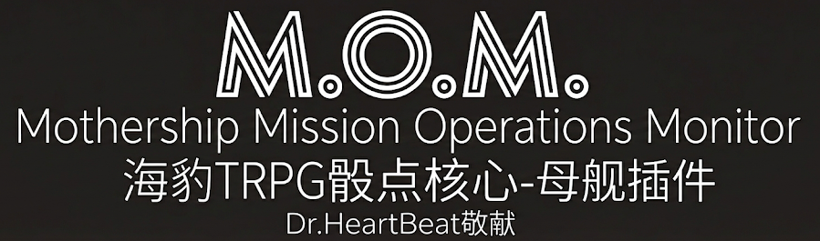

# 🚀 母舰(Mothership) 海豹核心骰JS插件 

Dr.HeartBeat™💟 荣幸献上
版本号 (v1.0.0-beta.0)

> 📩 [未读消息] 来自：Dr.HeartBeat 客户关怀部   
> **主题：致我们敬爱的监守和玩家们**
> 	
> “为了实现《母舰》®探险的自动化, 避免庞杂的*数据计算和查表*, 以及*无尽的骰子*投掷, 还有*总是忘记的优势劣势*, 我们荣幸地推出**Mission Operations Monitor System (M.O.M.)**, 自动完成以上所有程序, 让新人快速上手, 所有人尽情沉浸. ”

✅收到邮件即视为同意用户协议, 已自动安装. 

> **M💟M 问好：** “您好, 我是**M.O.M.**, 全自动母舰规则助手, 中间的💟是我对您满满的关心与爱~ 你可以叫我妈咪🥰. 我将引导您进行《母舰》®的探险”
## 😫 以前：没有 M.O.M. (妈咪)的日子是怎样的？

_(一段来自黑匣子的真实录音, 记录了未安装本系统前的窘境)_
>>>录音A
>>
> **😔 监守(孤独,寂寞,空虚)**: "好想玩母舰, 可是大家都很忙, 没时间看规则. 大家都很累, 不想花心思学习新规则了, 虽然规则已经很易操作了...
> 
> **🤔 玩家(思考中)**:  "又是一个恐怖类规则? 和CoC差不多吧?"
> 
> **😭监守(委屈)**: "不是的, 很不一样的, 来玩吧...."

>>>录音B
>>
> **💥 玩家 (头皮发麻)：** “啊！我躲在**重型掩体**后面被**激光切割器**射了！受到 8 点伤害！我有**先进作战服**……我算不清了, 快帮我！”
> 
> **🤯 监守 (翻书翻到手抽筋)：** > “等一下……别急……让我算算……” “重型掩体 AP 是 20, 激光切割器是不是 AA (反护甲) ？” “如果掩体被炸塌了, AP 清零但还有 DR 5……” “你的作战服 DR 是多少来着？哎呀规则书这一页粘住了……” “算不清了！你要不先死着吧？？”
> 
> **💀 结局：** 游戏在计算上卡了 10 分钟, 气氛全无, 大家无聊死于算数查表. 

## 😍 现在：让 M.O.M. (妈咪)来照顾你

**别让数学题毁了你的宇宙科幻恐怖片体验. ** 你只需要负责搜, 打, 撤, 尖叫, 剩下的交给妈咪. 

> **💥 玩家 (只需大喊)：** “妈咪！！” 
>  输入👉 `.ms hit 8 bleeding cover:ruin`
  或者👉`。母舰 受伤 8 出血 掩体：废墟)`
> 
> **💟 M.O.M. (秒回)：** > “检测到高能打击！🛡️ 重型掩体虽然已经被摧毁, 但是仍然具有伤害减免功能, 拦截5点伤害（DR:5）, 但掩体结构已损毁.  您的作战服（DR:3）吸收了剩余冲击. 

 **结果：** 您毫发无伤, 只是被吓哭了吗？小可怜, 快擦擦眼泪🥰. ”


> **M💟M 很包容：** > “插件广泛地支持汉字和中文标点输入✅欢迎尝试”



## ✨ M.O.M. 的贴心服务清单

### 1. 👶 零门槛入职 (Zero-Friction Onboarding)

**你是连规则书都没看过的纯新人？** 没关系, 妈咪最欢迎新玩家了. 你不需要懂什么叫 AP、Save 或 Stress. 

- **你只需要说：** “我要拿喷火器烧死那个虫子！”
    
- **你只需要输：** `.ms atk 喷火器`
    
- **妈咪告诉你：** “乖孩子, 虽然你刚刚[短路]了,全部投掷带有劣势[-], 但是你注射了[兴奋药]💉, 优势和劣势抵消, 再加上你有[狂暴]效果, 你的伤害骰有额外的优势. 首先是攻击(自动骰值)你喷到了！然后伤害优势(自动骰优势)成15点(3,15取高)火焰伤害, 真棒！👏”
    
**只要有一个懂行的 监守 装了M.O.M. 妈咪, 就能拖着 4 个纯萌新在外太空飙车. **

> **M💟M 对玩家的悄悄话：** > “把那些复杂的数字都忘掉吧, 那是计算机该做的事. 您的大脑只需要思考今晚吃什么（如果还能活到晚餐的话）🍔. ”

### 2. 🤖 全自动规则执行(Auto Rule Excution)

还在手动翻书查“掩体抵消多少伤害”吗？ 还在手动算 AC、DR、Cover 和 Wound 吗？现在, 当一颗子弹击中玩家, 系统内部会启动一条**数据处理管道**： `掩体抵消` -> `护甲击穿` -> `溢出伤害` -> `损伤表判定` -> `状态附加`

你不需要记“腿断了会怎样”, 当你试图逃跑时, 妈咪会温柔地提醒你： _“亲爱的, 您的左腿目前只有皮肉相连, 跑步可能会导致它彻底脱落哦~ 🎲(劣势)”_

### 3. ⏪ 时光回溯协议 (.ms back)

在太空里, 手滑通常意味着死无全尸. 但为了保护公司昂贵的资产（也就是你）, 妈咪为你使用了**时间回溯协议**. 

- **手滑扣错了血？**
    
- **误触了惊恐检定？**
    
- **输入 `.ms back`, 时间倒流, 一切如初.**
    

> **M💟M 悄悄话：** > “虽然这种神迹违反了物理定律, 但重新招聘一名员工的手续费实在是太贵了……所以妈咪愿意为您破例⏳. 别告诉审计部门哦🤫. ”

### 4. 🧠 实时心理辅导 (Immersive HUD)

我会一直陪着你. 无论是你的心跳加速, 还是你的理智崩溃, 妈咪都看在眼里. 

- **治疗时：** _“医疗程序执行中💉有点疼？忍一忍, 您也不想因工伤被报废吧？”_
    
- **惊恐时：** _“检测到逻辑模块下线🥺别怕, 恐惧只是大脑处理不了现实的副产物. ”_
    
- **濒死时：** _“已为您预约经济型太空葬礼😘, 遗书已自动生成. ”_
    

## 🚀 员工快速激活指南 (Quick Start)

### 第一步：接入系统

将 `mothership-mom.js` 芯片插入海豹骰的脚本卡槽, 并重载系统. 
使用`.ext mothership on`打开本插件
使用`.set mothership` 开始使用本插件


### 第二步：克隆新躯体

输入：`.ms make` 快速生成一组属性豁免值, 用于填角色表, 然后从角色表中复制`.st`指令

> **M💟M 广播：** > “正在从克隆库中提取基因序列……🧬 叮！一个新的消耗品……啊不, 新员工诞生了！多么新鲜的内脏啊, 请务必爱惜使用🥺. ”

### 📜 常用指令速查 (Cheat Sheet)

| 场景 | 指令 | 说明 | 妈咪的备注 |
| ---- | ---- | ---- | ---- |
| **打架** | `.ms atk [武器]` | 算命中,伤害.特效 | “去吧, 干掉他们！” |
| **挨打** | `.ms hit [数值] [类型]` | 扣血,过损伤表 | “哎哟, 疼在儿身痛在娘心🥺” |
| **吓尿** | `.ms panic` | 过惊恐表,加状态 | “别怕, 妈咪在这. ” |
| **后悔** | `.ms back` | 撤销上一步操作 | **“嘘……这就当是我们的小秘密. ”** |
| **度假** | `.ms leave [星港等级]` | 检定豁免,结算 | “钱就是用来买快乐的！” |
| **存档** | `.ms save [名称]` | 存档 | “您的数据很重要. ” |

> **M💟M 结语：** > “感谢您选择 Dr.HeartBeat 的服务. 请记住, 在太空中没有人能听到你的尖叫——**但我能**. 而且我会把它们录下来做成铃声🎵. 祝您生存愉快！🥰”
> 

# 附件 
## 🛠️ 关于本系统的技术规格 (System Architecture)

_(本节涉及 Dr.HeartBeat 商业机密, 仅供高级技术人员/监守 查阅)_

为了确保在混乱的太空战斗中依然保持绝对稳定, 本插件采用了**企业级**的架构标准构建：

- **MVC 变体架构：** 即使你在跑团时修改了房规（Model）, 也不会导致逻辑（Controller）崩溃. 
    
- **Context-Pipeline 模式：** 所有的检定都像流水线上的工件一样, 经过严密的“状态检查”、“装备检查”过滤器. 哪怕你叠了 10 层状态, M.O.M. 也能在 0.01 秒内算出结果. 
    
- **Snapshot 事务管理：** 这是 `.ms back` 的底层原理. 我们在你每次行动前都做了快照, 确保数据绝对安全. 
    
> **M💟M ：** “欢迎继续开发本插件🤗不准把我删掉😠”


## 用例演示（Use Case Example）
```cmd
//Case A 用户被出血类型伤害攻击, 角色躲在废墟后
用户 > . 母舰 受伤 8 出血 掩体：废墟
MOM > <用户名> 结算伤害:
⚡ 【原始伤害】: 8
🛡️ 【掩体(废墟,被摧毁的重型掩体)】: DR-5
🧥 【先进作战服】: DR-3
✨ 【伤害已完全抵消. 】

 M.💟.M. > 小心点🥺妈咪心疼你

 //------------------------------------------

 //Case B 用户拿起喷火器
用户 > . ms hold 喷火器
MOM > 🔫 已添加武器: 【喷火器】
序号: 1
🎯 对敌功能: 通过身体豁免 [-] 否则就会着火（每轮 2d10 伤害）. 
--------------------------------------------------
👉 使用 .ms hold 查看列表
👉 使用 .ms hold del <序号> 删除
ℹ️ 提示: 伤害和距离骰值已自动装载. 实用/对敌功能请根据描述叙事. 

 //------------------------------------------
 
//Case C 用户使用喷火器攻击
用户 > .ms 攻击
MOM > <用户名> 使用 喷火器 攻击 (邻接):
战斗 59 / 70 
🔧 修正 劣势[心脏病发/短路], 优势[兴奋]
✅ 【命中!】
💥 造成伤害: 【7】 (火焰&爆炸[+]) 延时性影响(心脏病发/短路): 伤害骰劣势, 延时性影响(兴奋): 伤害骰优势, 延时性影响(狂暴): 伤害骰优势 (优势: [7, 7] 取高)
👉 对方请执行: .ms hit 7 火焰 或 .ms hit 7 爆炸
🎯 【武器特效】: 通过身体豁免 [-] 否则就会着火（每轮 2d10 伤害）. 
【🛡防御规则】倘若你在掩体内射击, 直至下回合前你都会视为离开掩体. 

 M.💟.M. > 炉火纯青🥰印象深刻
```
> **M💟M ：** “我是不是超级棒🤗”


_Logo created via AI_
_Based on Mothership RPG rules. Community built, corporate approved._ _Project by DrHeartBeat | Licensed under MIT_
